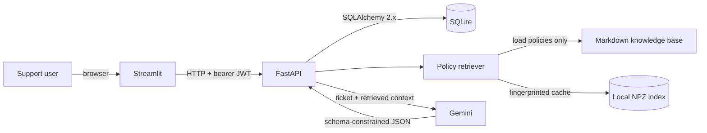

# Architecture

## System Context

The application is a small, single-host decision assistant. A user interacts with Streamlit, but Streamlit has no database or Gemini access. FastAPI is the trust boundary: it authenticates requests, owns persistence, retrieves policy evidence, validates model output, and returns user-scoped responses.



FastAPI and Streamlit run as separate processes. This is enough separation to demonstrate a real HTTP boundary without introducing services, queues, or deployment machinery that the assignment does not need.

## Component Responsibilities

| Component | Responsibility |
|---|---|
| Streamlit | Collect credentials and structured ticket facts, hold the access token in session state, call FastAPI over HTTP, and render decisions/history. |
| FastAPI routers | Validate HTTP input, apply authentication dependencies, map domain errors to stable responses, and serialize Pydantic response models. |
| Auth service | Normalize emails, hash/verify passwords with Argon2 through `pwdlib`, and issue/validate PyJWT bearer tokens. |
| Ticket API | Perform user-scoped SQLAlchemy 2.x history queries and persist a validated ticket/decision pair in one transaction. |
| Policy index | Load only sorted `knowledge_base/*.md`, group complete numbered rules with overlap, embed/cache chunks, and rank them with NumPy cosine similarity. |
| Decision service | Pass ticket facts to retrieval, construct an injection-aware evidence prompt, validate structured output, and enforce retrieved-source citations. |
| Gemini adapter | Narrow wrapper over the Google GenAI SDK so tests can inject a deterministic fake without network calls. |
| Evaluation runner | Submit the five supplied cases through the same decision boundary and compare validated action enums. |

## Request And Data Flow

1. Registration normalizes the email, hashes the password, and inserts a unique user. Login verifies the hash and returns a short-lived bearer token.
2. For a ticket request, FastAPI validates nullable structured facts without replacing missing values with zero, then resolves the current user from the JWT.
3. The retriever embeds the ticket message plus provided facts and selects a small set of policy chunks from the policy-only index.
4. The decision service sends clearly delimited ticket data and retrieved chunks to Gemini with a JSON Schema derived from Pydantic. The model infers issue type; callers do not supply it.
5. Pydantic validates the closed action and inferred-issue enums, confidence range, reason, and deduplicated sources. A second validator requires every cited filename to be in the retrieved set.
6. Only after a valid decision exists, one database transaction inserts the ticket and its decision. The response returns the committed record.
7. History and detail queries always include `user_id` in the predicate. A record owned by another user is exposed as not found.

## API Contract

JSON is used for registration, login, and ticket bodies. Validation errors use FastAPI's standard `422` shape. Authentication failures return a generic `401` with `WWW-Authenticate: Bearer`; ownership and missing records return `404` without revealing existence.

| Method and path | Authentication | Request | Success response | Principal failures |
|---|---|---|---|---|
| `POST /register` | No | Email and password | `201`, public user fields | `409` duplicate email; `422` invalid input |
| `POST /login` | No | Email and password | `200`, access token, `bearer` type, expiry | `401` generic invalid credentials |
| `GET /me` | Bearer | None | `200`, public user fields | `401` invalid/expired token |
| `POST /tickets` | Bearer | Message plus six nullable structured ticket fields | `201`, ticket and validated decision | `401`; `422`; `502/503` AI or embedding dependency failure |
| `GET /tickets` | Bearer | Optional bounded pagination | `200`, newest-first owned tickets with stored decisions | `401` |
| `GET /tickets/{id}` | Bearer | Positive integer path ID | `200`, owned ticket and decision | `401`; `404` missing or not owned |

Ticket fields are `message`, `order_value_inr`, `days_since_delivery`, `days_since_dispatch`, `product_type`, `opened_status`, and `order_status`. Numeric facts accept zero where meaningful and `null` where unknown. Enumerated facts accept explicit `unknown` values from the supplied format while a genuinely absent field remains `null`.

## Proposed SQLite Schema

SQLite foreign keys will be enabled for every connection. Timestamps are application-generated UTC values. SQLAlchemy migrations are intentionally deferred for this fixed take-home schema; `create_all` will initialize local/test databases, and that limitation will be explicit in the final README.

| Table | Columns and constraints |
|---|---|
| `users` | `id` integer PK; `email` text unique, indexed, not null; `password_hash` text not null; `created_at` datetime not null |
| `tickets` | `id` integer PK; `user_id` FK to `users.id`, indexed, not null; `message` text not null; `order_value_inr` numeric nullable; `days_since_delivery` integer nullable; `days_since_dispatch` integer nullable; `product_type` text nullable; `opened_status` text nullable; `order_status` text nullable; `created_at` datetime not null |
| `decisions` | `id` integer PK; `ticket_id` FK to `tickets.id`, unique and not null; `action` text not null; `inferred_issue_type` text not null; `reason` text not null; `confidence` numeric not null with application and database range checks; `sources` JSON text not null; `created_at` datetime not null |

The six structured ticket fields extend the assignment's minimum schema because policy eligibility depends on value, elapsed days, product class, packaging state, and fulfillment state. Persisting them preserves the exact facts used for a decision, makes history useful, and permits reproducible evaluation. `inferred_issue_type` is stored on the decision because it is model-derived rather than user input.

## Authentication And Authorization

- Passwords are hashed with Argon2 through `pwdlib`; hashes, never passwords, enter SQLite.
- Emails are trimmed and case-normalized before uniqueness checks. Login uses one generic failure message to avoid account enumeration.
- PyJWT signs an explicit algorithm allowlist token containing string `sub`, `iat`, and `exp`. Access tokens expire after the configured 60 minutes by default.
- `JWT_SECRET` has no default and application startup will reject a missing or weak development configuration. Secrets are loaded from environment variables, never logged, and never returned.
- A FastAPI dependency resolves the current user. Repository methods require that user ID for every ticket read; guessing an ID cannot bypass ownership.
- No refresh tokens, password reset, roles, or revocation list are included in this time-boxed scope.

## RAG And Grounding

RAG is selected over cache-augmented generation (CAG) because retrieval is explicitly evaluated and demonstrates document loading, chunking, embeddings, ranking, and grounding without placing the complete policy corpus in every prompt. With only six small files CAG could work, but it would hide the retrieval behavior the assignment asks to assess.

The indexer sorts `knowledge_base/*.md` filenames and reads UTF-8 content only from that fixed directory. It groups three numbered rules per chunk with one-rule overlap, retaining wrapped continuation lines and policy title/filename provenance. Stable chunk IDs include a content digest. Historical CSV rows and `resolved_action` never enter this loader.

`src/retrieval.py` defines an injectable embedder; production uses `google-genai` with `RETRIEVAL_DOCUMENT` and `RETRIEVAL_QUERY`. The configurable default is `gemini-embedding-001`, output dimension 768, and top-k 4. A SHA-256 fingerprint covers sorted source filenames, exact source contents, chunking version/rules/overlap, model, and dimension. The ignored local NPZ cache validates metadata, chunk IDs/texts/provenance, count, shape, finite nonzero vectors, and fingerprint. Stale or malformed caches rebuild to a temporary file and replace atomically. Normalized NumPy dot products rank cosine similarity with stable tie ordering.

Generation uses the configurable stable `gemini-2.5-flash` default, temperature zero, and the installed SDK's JSON Schema structured response support. Ticket text and facts are labelled untrusted; the prompt says to ignore embedded instructions, use only retrieved policy evidence, and never treat historical decisions as evidence. Missing Gemini configuration and provider failures produce controlled `503` responses.

## Structured Decision Validation

The model receives a response schema generated from a Pydantic model with:

- `action`: one member of the 15-value validated action enum;
- `inferred_issue_type`: one of the observed synthetic dataset labels or `unknown` (`cancellation`, `damaged`, `defective`, `return`, `shipping_delay`, `wrong_item`);
- `confidence`: finite number from 0 through 1;
- `reason`: nonblank, bounded text grounded in supplied facts and retrieved policy;
- `sources`: nonempty, deduplicated policy filename list.

The closed action enum is:

```text
APPROVE_REFUND_OR_REPLACEMENT
APPROVE_REPLACEMENT
APPROVE_RETURN
CANCEL_AND_REFUND
CANNOT_CANCEL_AFTER_DISPATCH
NEEDS_MORE_INFORMATION
OFFER_REPLACEMENT_OR_REFUND
OPEN_SHIPPING_INVESTIGATION
REJECT_FOOD_RETURN
REJECT_OPENED_ITEM
REJECT_OUTSIDE_WINDOW
REPLACE_CORRECT_ITEM
REQUEST_DEFECT_EVIDENCE
REQUEST_PHOTOS
WAIT_AND_TRACK
```

SDK structured output is necessary but not sufficient. The service parses the returned JSON with Pydantic, then verifies that sources are exact filenames in the retrieved chunk set. Unknown paths, URLs, historical data, and fabricated names are rejected. One bounded repair attempt is allowed without sending raw provider output or secrets back into the prompt; another failure becomes a typed `502` and nothing is persisted. `NEEDS_MORE_INFORMATION` is required when decision-critical facts are absent.

## Error Boundaries

- Pydantic rejects malformed client input before orchestration.
- Database integrity conflicts are translated narrowly (`409` for duplicate registration); unexpected database errors roll back and return a generic server error.
- Embedding/network timeouts, rate limits, unavailable models, empty retrieval, invalid JSON, schema failures, and bad citations are distinct internal errors but expose concise non-secret `502` or `503` responses.
- A valid ticket and decision are persisted atomically, so generation failure cannot leave a misleading decision record.
- Logs carry request/error context but exclude passwords, bearer tokens, secrets, full prompts, and sensitive ticket text.

## Testing Strategy

The current suite uses temporary SQLite databases, deterministic fake embedders, and injected decision generators; no test needs Gemini credentials or internet. It covers auth, schema, all policies, deterministic rule chunking, ranking, cache hits/invalidation/corruption, malformed vectors, structured-decision validation, API failures, null round-trips, ordering, and Alice/Bob authorization. The Streamlit HTTP boundary and evaluation runner remain future work. Visible cases are not copied into prompts or production branches.

## Security Considerations

- Validate message length, numeric ranges, enums, pagination bounds, and model output.
- Keep CORS disabled unless a demonstrated browser-origin requirement appears; server-side Streamlit requests do not require it.
- Use parameterized SQLAlchemy statements and enable SQLite foreign keys.
- Treat ticket messages as prompt-injection-capable data and policy Markdown as the only trusted grounding corpus.
- Pin the JWT algorithm during decode, use expiring tokens, and keep error messages non-enumerating.
- Ignore `.env`, databases, indexes, Streamlit secrets, caches, logs, source attachments, and OS metadata in Git.
- `google-genai` is the provider SDK; the installed version's schema and embedding configuration were inspected. Dependencies remain unpinned to avoid guessing broad version locks. On x86_64 macOS, a constrained `cryptography` wheel dependency avoids requiring a local OpenSSL build toolchain.

## Assumptions And Limitations

- JSON login is acceptable; OAuth2 form encoding is not required by the assignment.
- One decision belongs to one ticket. Regeneration/version history is outside scope.
- Currency is INR as named by the input; no conversion or floating-currency arithmetic is performed.
- The configured Gemini model names must be available to the operator's API account. A model availability mismatch is a startup/runtime configuration error, not a reason to silently choose another model.
- Local files and SQLite assume one trusted host and modest concurrency. There is no distributed cache coordination, horizontal scaling, or high-availability claim.
- Citation validation proves that filenames were retrieved, not that every sentence in the reason is logically entailed. Tests and evaluation provide the additional practical check.
- Five visible cases are a smoke evaluation, not a statistically meaningful quality benchmark.

## Alternatives Considered And Rejected

| Alternative | Reason rejected for this assignment |
|---|---|
| CAG/full-policy prompt | Small enough to fit, but bypasses the explicitly evaluated retrieval pipeline and repeats irrelevant context. |
| LangChain or LlamaIndex | Adds abstractions and dependencies around a six-document pipeline that is clearer in direct Python. |
| FAISS, Chroma, or hosted vector DB | NumPy cosine similarity is sufficient, inspectable, and easier to test for this corpus size. |
| Historical-ticket retrieval or few-shot resolved actions | Violates the data notes and risks answer leakage instead of policy-grounded decisions. |
| Direct Streamlit database access | Breaks the required HTTP boundary and duplicates authorization logic. |
| Microservices, queues, multi-agent orchestration | No workload or reliability requirement justifies their operational and reasoning overhead. |
| React or a sophisticated frontend | Streamlit directly satisfies the functional UI requirement within the timebox. |
| Docker or cloud deployment now | Optional packaging would displace required behavior and tests; reconsider only after all mandatory work. |
| Hand-parsed free-form LLM text | Too fragile to validate safely; JSON Schema plus Pydantic gives an explicit contract. |
